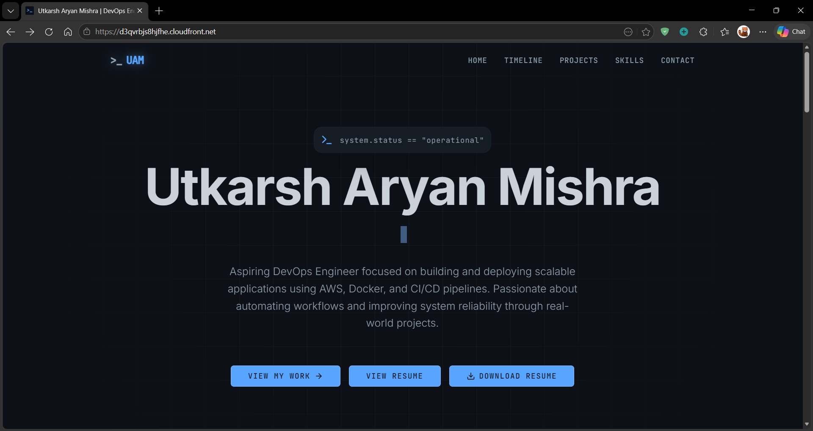
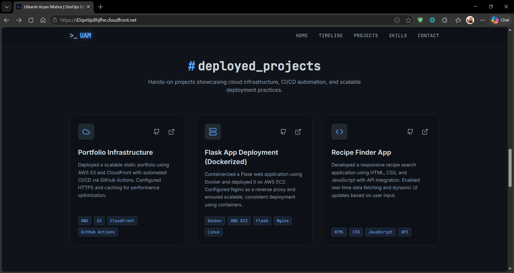
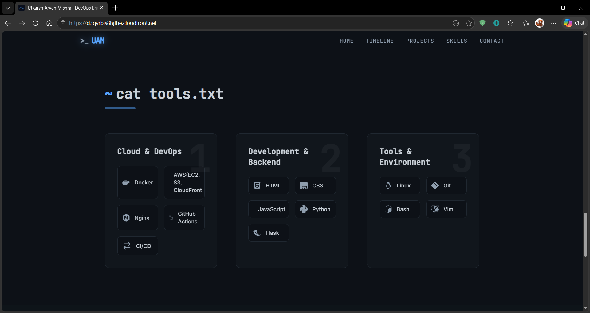
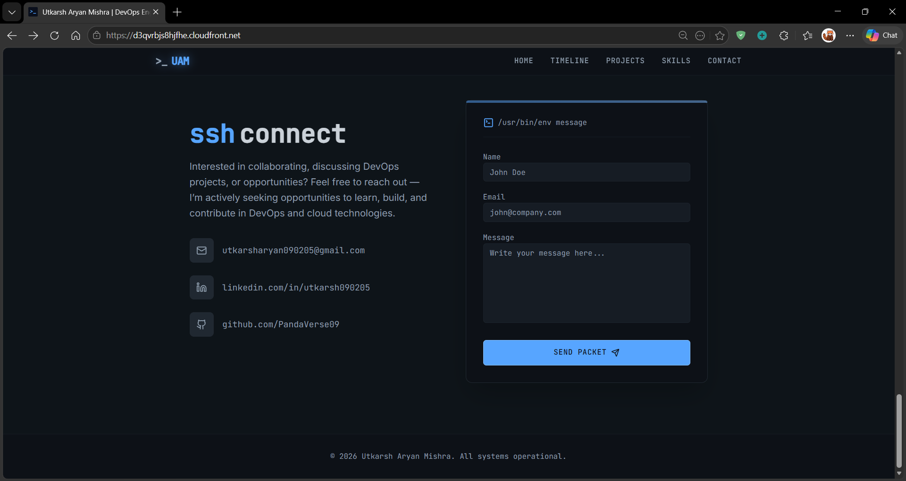

# 🌐 DevOps Portfolio Website (React + TypeScript + AWS + CI/CD)

<p align="center">
  
  
  
  
</p>

---

## 📌 Overview

This project is a **modern portfolio website** built using **React and TypeScript**, deployed on **AWS S3 and CloudFront**, and automated with a **CI/CD pipeline using GitHub Actions**.

It demonstrates real-world **frontend architecture + DevOps practices**, including component-based design, automated deployment, and global content delivery.

---

## 🌐 Live Demo

👉 https://d3qvrbjs8hjfhe.cloudfront.net/

---

## 🖼️ Screenshots

### 🏠 Homepage



### 💼 Projects



### 🧠 Skills



### 📞 Contact



---

## 🏗️ Architecture

```
User → CloudFront (CDN) → AWS S3 (Static Hosting)
                      ↑
              GitHub Actions (CI/CD)
                      ↑
                  GitHub Repo
```

---

## ⚙️ Tech Stack

### 🔹 Frontend

* React.js
* TypeScript
* Vite

### 🔹 Architecture

* Component-based structure
* Reusable UI components
* Custom hooks

### 🔹 DevOps & Cloud

* AWS S3 (Static Hosting)
* AWS CloudFront (CDN)
* GitHub Actions (CI/CD)

### 🔹 Tools

* Git & GitHub
* VS Code

---

## 📂 Project Structure

```
portfolio_v2/
│── public/
│── src/
│    ├── components/
│    ├── hooks/
│    ├── pages/
│    ├── App.tsx
│    ├── main.tsx
│── images/
│── .github/workflows/
│── package.json
│── tsconfig.json
│── vite.config.ts
│── README.md
```

---

## 🔄 CI/CD Workflow

1. Code pushed to GitHub
2. GitHub Actions triggers automatically
3. Project is built using Vite
4. Build files deployed to AWS S3
5. CloudFront serves content globally

---

## 🚀 Features

* Modern UI with React + TypeScript
* Component-based scalable architecture
* Fast builds using Vite
* Global content delivery via CDN
* Automated CI/CD pipeline
* Responsive design

---

## 📊 What This Project Demonstrates

✔ Modern frontend development (React + TypeScript)
✔ Real-world DevOps pipeline (CI/CD)
✔ Cloud deployment using AWS
✔ Scalable static architecture

---

## 🤝 Connect with Me

* LinkedIn: https://www.linkedin.com/in/utkarsh090205/
* GitHub: https://github.com/PandaVerse09

---

## ⭐ Support

If you like this project, consider giving it a ⭐ on GitHub!
